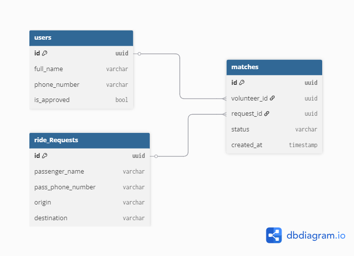

# HesedRide 🚗

מערכת חכמה לניהול ושידוך נסיעות בין מתנדבים לנזקקים.

## 🏗️ Database Architecture


## 💻 Tech Stack
* **Backend:** FastAPI (Python)
* **Frontend:** React Native (Expo)
* **Database:** PostgreSQL (Supabase)

## ⚙️ התקנת תלויות (Installation)

### Backend — Python
וודאי שיש לך Python 3.10+ מותקן, לאחר מכן הריצי:
```bash
pip install -r requirements.txt
```

הספריות הנדרשות (`requirements.txt`):
```
# Web Framework
fastapi==0.115.0
uvicorn[standard]==0.30.6

# Database
sqlalchemy==2.0.36
psycopg2-binary==2.9.10

# Data Validation
pydantic==2.9.2

# Authentication
PyJWT==2.9.0

# Environment Variables
python-dotenv==1.0.1

# HTTP Requests (Google Maps API)
requests==2.32.3
```

### Frontend — Node.js
```bash
npm install
```

## 🔐 משתני סביבה (Environment Variables)
צרי קובץ `.env` בשורש הפרויקט עם:
```
DATABASE_URL=your_supabase_connection_string
JWT_SECRET=your_secret_key
GOOGLE_MAPS_API_KEY=your_google_maps_key
```

## 🚀 איך להריץ את הפרויקט (Getting Started)

### Backend
1. נווטי לתיקיית הפרויקט הראשית.
2. הפעילי את הסביבה הווירטואלית: `venv\Scripts\activate`
3. התקיני תלויות: `pip install -r requirements.txt`
4. הריצי את השרת: `uvicorn app.main:app --host 127.0.0.1 --port 8000 --reload`
5. ה-API יהיה זמין בכתובת: `http://localhost:8000/docs`

### Frontend
1. נווטי לתיקיית `frontend-mobile`.
2. הריצי: `npx expo start --web`

## 📋 סטטוס פיתוח (Milestone 2)
- [x] מנגנון הרשמה (Signup)
- [x] מנגנון התחברות (Login)
- [ ] דשבורד נסיעות (GET /api/requests)
- [ ] מסך בחירת נסיעה
